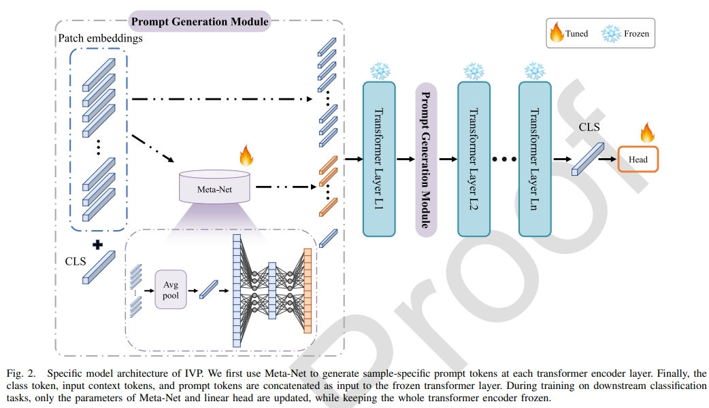

# IVP
This is Pytorch implementation for "Rethinking Remote Sensing Pretrained Model: Instance-Aware Visual Prompting for Remote Sensing Scene Classification". If you have any questions, please contact kys220900680@hnu.edu.cn
## Overview


## Dataset Preparation
### Dataset Structure
### Data Download
The LEVIR-CD-Point dataset can be downloaded from: [here](https://pan.baidu.com/s/1bV1TCNxbloJveqh1eG3a7w?pwd=dskl) 

The DSIFN-CD-Point dataset can be downloaded from: [here](https://pan.baidu.com/s/12wkHXxStmlrgcNk3yMdqyA?pwd=dlst) 

## Training
```
CUDA_VISIBLE_DEVICES=0 python -m torch.distributed.launch --nproc_per_node 1 --master_port 7777 main.py --dataset 'aid' --model 'swin' --ratio 28 --exp_num 5 --batch-size 64 --epochs 120 --img_size 224 --split 1 --lr 5e-4  --weight_decay 0.05 --gpu_num 1 --output Experiment_deep/checkpoint --pretrained /mnt/XXX/XXX//pretrained/rsp-swin-t-ckpt.pth --cfg configs/swin_tiny_patch4_window7_224.yaml
```

## Citation

   If you find our repo useful for your research, please consider citing our paper:
   ```bibtex
   @article{fang2023rethinking,
  title={Rethinking Remote Sensing Pretrained Model: Instance-Aware Visual Prompting for Remote Sensing Scene Classification},
  author={Fang, Leyuan and Kuang, Yang and Liu, Qiang and Yang, Yi and Yue, Jun},
  journal={IEEE Transactions on Geoscience and Remote Sensing},
  volume={61},
  pages={1--13},
  year={2023},
  publisher={IEEE}}
   ```
